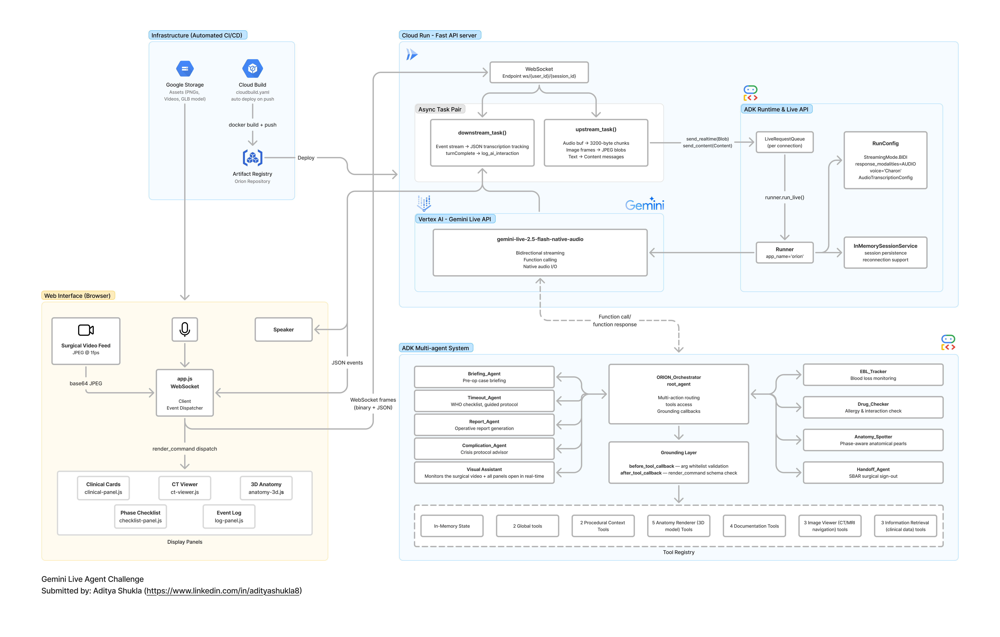
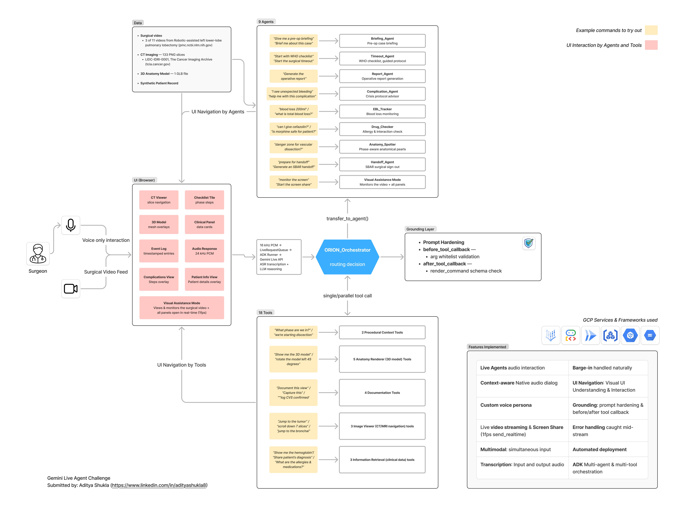

# ORION — Operating Room Intelligent Orchestration Node

> **Voice-directed surgical co-pilot for the da Vinci robotic surgery platform.**
> A real-time, hands-free AI agent that gives surgeons instant access to patient data, CT imaging, 3D anatomy, drug safety checks, and operative documentation — all through natural speech, without ever breaking scrub.

**Built for:** Gemini Live Agent Challenge

**Hackathon Category:** Live Agents + UI Navigation

**Built with:** Google ADK · Gemini Live API · Vertex AI · Cloud Run · GCS

**Demo:** https://vimeo.com/1173625793?fl=ip&fe=ec

**Live deployment:** https://orion-518946358970.us-central1.run.app/

---

## Table of Contents

- [Disclaimer](#disclaimer)
- [The Problem](#the-problem-five-unsolved-challenges-in-robotic-surgery)
- [The Solution](#the-solution-what-orion-does)
- [Architecture](#architecture)
  - [System Overview](#system-overview)
  - [Agentic Workflow](#agentic-workflow)
- [Agent System](#agent-system)
  - [Root Orchestrator](#root-orchestrator--orion_orchestrator)
  - [Specialist Sub-Agents](#8-specialist-sub-agents)
  - [Tool Registry](#tool-registry-22-tools)
- [Gemini & ADK Features Used](#gemini--adk-features-used)
  - [Gemini Live API](#gemini-live-api)
  - [Google ADK](#google-adk-v1260)
  - [Grounding & Safety / Hallucination Handling Layer](#grounding--safety)
- [Tech Stack](#tech-stack)
- [GCP Backend & Logs Demo (for Hackathon)](#gcp-backend--logs)
- [Local Setup](#local-setup)
- [Assets Setup](#assets-setup)
- [Cloud Deployment & Automation](#cloud-deployment)
- [Project Structure](#project-structure)
- [Data Sources](#data-sources)
- [Key Voice Commands](#key-voice-commands)
- [Hackathon](#hackathon)

---

## Disclaimer

This project is designed to demonstrate the capabilities of the Gemini Live API and Google Agent Development Kit (ADK). It may contain clinical inaccuracies and has not been reviewed by medical domain experts.

---

## The Problem: Five Unsolved Challenges in Robotic Surgery

During robotic surgery, the operating surgeon's hands are **locked on instrument controls** inside a sterile field for the entire procedure. They cannot type, click, tap, or interact with any computer system. Every piece of critical information — patient labs, CT imaging, drug safety checks, phase checklists — requires them to either break scrub or call out to circulating staff. Both are slow, disruptive, and potentially dangerous at the wrong moment.

Beyond the access problem, five specific, evidence-backed failures compound surgical risk:

| # | Challenge | Metric | Source |
|---|-----------|--------|--------|
| 1 | **CVS documentation gap** — Critical View of Safety is rarely confirmed before bile duct division | Only **23.1%** of laparoscopic cholecystectomies have CVS documented | Terho et al. 2021 ([PMID 33975802](https://pubmed.ncbi.nlm.nih.gov/33975802/)) |
| 2 | **WHO Surgical Checklist compliance** — life-saving but inconsistently executed under OR pressure | Implementing the checklist reduces mortality by **47%** and complications by **36%** | Haynes et al. 2009, NEJM ([PMID 19144931](https://pubmed.ncbi.nlm.nih.gov/19144931/)) |
| 3 | **Blood loss estimation error** — visual EBL is unreliable, delaying transfusion decisions | Surgeons underestimate by **52–85%**; 95% of clinicians are wrong by >25% | [PMC7943515](https://www.ncbi.nlm.nih.gov/pmc/articles/PMC7943515/) |
| 4 | **Operative note delays** — critical documentation written days after the procedure from memory | Mean dictation delay of **15.6 days** vs. 28 minutes with voice templates | Laflamme et al. ([PMC1560865](https://www.ncbi.nlm.nih.gov/pmc/articles/PMC1560865/)) |
| 5 | **Intraoperative drug errors** — wrong drug, dose, or timing without real-time cross-checks | **1 in 20** anesthesia administrations has an error; 80% are preventable | Nanji et al. ([PMC4681677](https://www.ncbi.nlm.nih.gov/pmc/articles/PMC4681677/)) |

---

## The Solution: What ORION Does

ORION is a **voice-activated surgical co-pilot** that listens to the surgeon continuously throughout the procedure. The surgeon speaks naturally — `"ORION, show hemoglobin"`, `"run the timeout"`, `"I have bleeding"`, `"is cefazolin safe?"` — and ORION responds in under a second with the right information on the console display and a calm, brief spoken confirmation.

The system watches the live surgical video at 1 fps, giving Gemini real-time OR context. Eight specialist agents handle different domains of surgical need: pre-op briefing, safety timeout, blood loss tracking, drug safety, anatomy guidance, complication protocols, operative documentation, and SBAR handoff — all orchestrated by a root agent that routes intelligently based on intent.

**ORION does not give clinical opinions.** It surfaces data, enforces protocols, and logs events. The surgeon decides. ORION makes sure they have what they need to decide correctly.

---

## Architecture



### System Overview

```
Browser (Surgical Console)
  │  16 kHz PCM audio  +  1 fps JPEG video frames
  │  ◄── 24 kHz PCM audio  +  JSON render_commands
  ▼
FastAPI WebSocket Server (Cloud Run)
  │  LiveRequestQueue  →  ADK Runner  →  Vertex AI Live API
  │                                            │
  │              Gemini 2.5 Flash Native Audio Dialog
  │              ASR · LLM reasoning · Native TTS · Function calling
  ▼
ORION_Orchestrator (root_agent)
  ├── 18 direct tools  (IR · IV · AR · PC · DOC)
  └── 8 specialist sub-agents
        Briefing_Agent · Timeout_Agent · Report_Agent · Complication_Advisor
        EBL_Tracker · Drug_Checker · Anatomy_Spotter · Handoff_Agent
```

### Agentic Workflow



---

## Agent System

### Root Orchestrator — `ORION_Orchestrator`

Handles all voice input, applies wake-word filtering, and either calls direct tools or routes to a specialist sub-agent via `transfer_to_agent()`. Owns 18 direct tools for single-action and parallel multi-action commands.

### 8 Specialist Sub-Agents

| Agent | Trigger phrases | Tools |
|-------|----------------|-------|
| **Briefing_Agent** | "brief me", "patient rundown", "case summary" | `display_all_patient_data`, `get_surgical_phase` |
| **Timeout_Agent** | "run the timeout", "WHO checklist", "safety check" | `hide_all_overlays`, `display_all_patient_data`, `get_surgical_phase`, `log_event`, `show_agent_summary` |
| **Report_Agent** | "operative report", "summarize the case", "what did we do" | `hide_all_overlays`, `show_event_log`, `display_all_patient_data`, `show_agent_summary` |
| **Complication_Advisor** | "I have bleeding", "air leak", "nerve injury", "we need to convert" | `get_complication_protocol`, `get_surgical_phase`, `toggle_structure`, `log_event`, `capture_surgical_photo`, `show_agent_summary` |
| **EBL_Tracker** | "blood loss 200 mL", "update EBL", "how much have we lost" | `update_ebl`, `get_ebl_summary`, `display_patient_data` |
| **Drug_Checker** | "can I give heparin", "is cefazolin safe", "check ketorolac" | `check_drug_safety`, `display_patient_data` |
| **Anatomy_Spotter** | "what's at risk", "danger zone", "anatomy check" | `get_anatomy_context`, `get_surgical_phase`, `toggle_structure`, `jump_to_landmark`, `navigate_ct`, `rotate_model` |
| **Handoff_Agent** | "prepare handoff", "sign out", "I'm scrubbing out" | `show_event_log`, `display_all_patient_data`, `get_surgical_phase`, `log_event`, `show_agent_summary` |

### Tool Registry (22 tools)

| Category | Tools |
|----------|-------|
| **Patient Data (IR)** | `display_patient_data`, `display_all_patient_data`, `hide_patient_data` |
| **CT Imaging (IV)** | `navigate_ct`, `jump_to_landmark`, `hide_ct` |
| **3D Model (AR)** | `rotate_model`, `toggle_structure`, `hide_3d`, `reset_3d_view`, `show_only_ar` |
| **Phase Checklist (PC)** | `get_surgical_phase`, `hide_surgical_checklist` |
| **Documentation (DOC)** | `log_event`, `capture_surgical_photo`, `show_event_log`, `hide_event_log` |
| **Specialist** | `update_ebl`, `get_ebl_summary`, `check_drug_safety`, `get_anatomy_context`, `get_complication_protocol`, `show_agent_summary` |

---

## Gemini & ADK Features Used

### Gemini Live API
- **Barge-in** — `StreamingMode.BIDI` lets the surgeon interrupt ORION mid-response at any time
- **Native audio dialog** — `response_modalities=['AUDIO']`, full speech-in / speech-out with no separate TTS step
- **Custom voice persona** — `PrebuiltVoiceConfig(voice_name='Charon')`, ORION has a consistent OR voice
- **Live video streaming** — surgical video frames sent at 1 fps as `image/jpeg` via `send_realtime()`, giving Gemini real-time OR context
- **Simultaneous multimodal input** — 16 kHz PCM audio + JPEG video on the same stream
- **Input + output audio transcription** — `AudioTranscriptionConfig()` on both sides; displayed live in the console
- **Function calling** — 22 tools declared via docstrings; the model selects and calls them autonomously

### Google ADK (v1.26.0)
- **Multi-agent hierarchy** — root orchestrator + 8 specialist sub-agents using `LlmAgent` + `sub_agents`
- **`transfer_to_agent()`** — LLM-driven dynamic routing at runtime
- **Parallel tool dispatch** — multi-action commands (`"show hemoglobin and open the CT"`) call multiple tools in one response turn
- **Before-tool grounding callbacks** — argument whitelists validated before every tool call
- **After-tool schema validation** — every tool response checked for valid `render_command` schema
- **`InMemorySessionService`** — session reconnection support via `get_session()` before `create_session()`
- **`LiveRequestQueue`** — per-connection audio buffer prevents race conditions
- **`aclosing()` generator cleanup** — guaranteed cleanup of `run_live()` async generator on cancellation
- **`FIRST_EXCEPTION` task pair** — allows multi-turn conversations without reconnecting
- **Zombie session prevention** — `live_request_queue.close()` always called in `finally` block

### Grounding & Safety
- **Argument whitelisting** — field names, landmark names, phase names, structure names, event types all validated against hardcoded whitelists before any tool executes
- **Hallucination prevention** — root agent instructed never to state patient data from memory; always calls the tool
- **Error recovery** — `ValueError/KeyError/TypeError` caught mid-stream; session continues and surgeon is notified

---

## Tech Stack

| Layer | Technology |
|-------|-----------|
| AI model | Gemini 2.5 Flash Preview Native Audio Dialog (Vertex AI) |
| Agent framework | Google ADK 1.26.0 |
| Backend | FastAPI + Uvicorn (Python 3.11) |
| Transport | WebSocket (bidirectional, binary + JSON) |
| Frontend | Vanilla HTML/CSS/JS — no framework |
| 3D rendering | Three.js r128 |
| Deployment | Google Cloud Run |
| CI/CD | Google Cloud Build (auto-deploy on push to `main`) |
| Image registry | Google Artifact Registry |
| Assets | Google Cloud Storage |

---

## GCP Backend & Logs


---

## Local Setup

### Prerequisites

- Python 3.11+
- `gcloud` CLI authenticated (`gcloud auth application-default login`)
- A Google Cloud project with Vertex AI API enabled
- A GCS bucket with CT slices, 3D model, and surgical videos (see [Assets Setup](#assets-setup))

### 1. Clone the repository

```bash
git clone https://github.com/adityashukla8/orion.git
cd orion
```

### 2. Create and activate a Python environment

```bash
python -m venv .venv
source .venv/bin/activate          # Windows: .venv\Scripts\activate
pip install -e .
```

Or with conda:

```bash
conda create -n orion python=3.11
conda activate orion
pip install -e .
```

### 3. Configure environment variables

```bash
cp app/.env.template app/.env
```

Edit `app/.env`:

```env
GOOGLE_GENAI_USE_VERTEXAI=1
GOOGLE_CLOUD_PROJECT=your-gcp-project-id
GOOGLE_CLOUD_LOCATION=us-central1

# Verify current model ID at:
# https://cloud.google.com/vertex-ai/generative-ai/docs/learn/models
DEMO_AGENT_MODEL=gemini-live-2.5-flash-native-audio

GCS_BUCKET=your-gcs-bucket-name
PATIENT_ID=case_demo_001
```

> **Never commit `app/.env` to source control.**

### 4. Authenticate with Google Cloud

```bash
gcloud auth application-default login
gcloud config set project your-gcp-project-id
```

### 5. Run the server

```bash
cd app
uvicorn main:app --reload --port 8080
```

> **Critical:** Run `uvicorn` from inside the `app/` directory. Running from the project root causes `ModuleNotFoundError` for `orion_orchestrator`.

### 6. Open the surgical console

Navigate to [http://localhost:8080/console](http://localhost:8080/console) in your browser.

- Click **Connect** to start the WebSocket session
- Allow microphone access when prompted
- Say **"ORION, brief me on this case"** to start

The landing page is at [http://localhost:8080](http://localhost:8080).

---

## Assets Setup

ORION requires three types of assets uploaded to a GCS bucket.

### GCS bucket layout

```
gs://your-bucket/
├── ct/case_demo_001/
│   ├── 001.png
│   ├── 002.png
│   └── ... (133 slices total)
├── models/
│   └── lung_model.glb
└── video/
    ├── surgical_video.mp4    # Phases: port_placement, inspection
    ├── mmc11.mp4             # Phases: fissure_development, vascular_dissection, bronchial_dissection
    └── mmc12.mp4             # Phases: specimen_extraction, lymph_node_dissection, closure
```

### CT slices (LIDC-IDRI-0001)

1. Download case **LIDC-IDRI-0001** from [The Cancer Imaging Archive](https://www.cancerimagingarchive.net/)
2. Convert DICOM to PNG:
   ```bash
   pip install pydicom Pillow numpy
   python assets/convert_ct.py assets/dicom_raw/ assets/ct_slices/
   ```
3. Upload to GCS:
   ```bash
   gsutil -m cp assets/ct_slices/*.png gs://your-bucket/ct/case_demo_001/
   ```

### 3D anatomy model

Source a lung GLB model (e.g. [NIH 3D Print Exchange](https://3d.nih.gov/) or [Sketchfab](https://sketchfab.com/)).
The model must contain meshes named: `lung_right`, `lung_left`, `bronchus`, `tumor`, `parenchyma`, `vessels`, `ribs`, `pleura`.

```bash
gsutil cp lung_model.glb gs://your-bucket/models/lung_model.glb
```

### Surgical videos

Source VATS lobectomy procedure videos (Pexels / Pixabay / open-access surgical archives).
Rename to match the filenames above and upload:

```bash
gsutil cp surgical_video.mp4 mmc11.mp4 mmc12.mp4 gs://your-bucket/video/
```

### Configure CORS for video frame capture

```bash
gsutil cors set cors.json gs://your-bucket
```

The `cors.json` is included in the repository root.

---

## Cloud Deployment

### Manual deploy to Cloud Run

```bash
# Build and push Docker image
docker build -t us-central1-docker.pkg.dev/YOUR_PROJECT/orion-repo/orion:latest .
docker push us-central1-docker.pkg.dev/YOUR_PROJECT/orion-repo/orion:latest

# Deploy to Cloud Run
gcloud run deploy orion \
  --image=us-central1-docker.pkg.dev/YOUR_PROJECT/orion-repo/orion:latest \
  --region=us-central1 \
  --platform=managed \
  --allow-unauthenticated \
  --port=8080 \
  --memory=2Gi \
  --cpu=2 \
  --timeout=3600 \
  --set-env-vars="GOOGLE_GENAI_USE_VERTEXAI=1,GOOGLE_CLOUD_PROJECT=YOUR_PROJECT,GOOGLE_CLOUD_LOCATION=us-central1"

# Set secret env vars separately (not in cloudbuild.yaml)
gcloud run services update orion \
  --region=us-central1 \
  --update-env-vars="DEMO_AGENT_MODEL=gemini-live-2.5-flash-native-audio,GCS_BUCKET=your-bucket,PATIENT_ID=case_demo_001"
```

### Automated CI/CD (Cloud Build)

Every push to `main` automatically builds, pushes, and deploys via `cloudbuild.yaml`.

To set up the trigger:

```bash
# Connect your GitHub repository in Cloud Build console, then:
gcloud builds triggers create github \
  --repo-name=orion \
  --repo-owner=adityashukla8 \
  --branch-pattern='^main$' \
  --build-config=cloudbuild.yaml \
  --region=us-central1
```

The pipeline runs three steps: Docker build → push to Artifact Registry → `gcloud run deploy` with the commit SHA tag.

> `DEMO_AGENT_MODEL`, `GCS_BUCKET`, and `PATIENT_ID` are set directly on the Cloud Run service and intentionally omitted from `cloudbuild.yaml` — they survive redeployments without being overwritten or exposed in source control.

---

## Project Structure

```
orion/
├── app/
│   ├── main.py                        # FastAPI server + WebSocket endpoint
│   ├── .env.template                  # Environment variable template
│   └── orion_orchestrator/
│       ├── __init__.py                # Exports root_agent (ADK requirement)
│       ├── agent.py                   # 9 LlmAgent definitions + grounding callbacks
│       └── tools.py                   # 22 tool functions + patient/drug/protocol data
│   └── static/
│       ├── index.html                 # Surgical console UI (4-panel layout)
│       ├── landing.html               # Public landing page
│       └── js/
│           ├── app.js                 # WebSocket client + event dispatcher
│           ├── ct-viewer.js           # CT PNG slice renderer (canvas)
│           ├── anatomy-3d.js          # Three.js GLB model renderer
│           ├── clinical-panel.js      # Clinical data card overlay
│           ├── checklist-panel.js     # Surgical phase checklist tile
│           └── log-panel.js           # Intraoperative event log tile
├── assets/
│   ├── convert_ct.py                  # DICOM → PNG converter
│   └── dicom_raw/                     # Raw DICOM files (LIDC-IDRI-0001)
├── Dockerfile                         # Container definition (WORKDIR: /app/app)
├── cloudbuild.yaml                    # Cloud Build CI/CD pipeline
├── cors.json                          # GCS CORS configuration
└── pyproject.toml                     # Python package manifest
```

---

## Data Sources

| Asset | Source | License |
|-------|--------|---------|
| CT imaging | [LIDC-IDRI-0001](https://www.cancerimagingarchive.net/collection/lidc-idri/), The Cancer Imaging Archive | CC BY 3.0 |
| 3D anatomy model | NIH 3D Print Exchange / Sketchfab | Per model license |
| Surgical videos | Open-access VATS lobectomy recordings (mmc6, mmc11, mmc12) | Per source license |
| Patient record | Synthetic FHIR-compliant demo data — no real clinical information | N/A |
| Drug database | Hardcoded pharmacology rules — 10 common intraoperative drugs | N/A |

---

## Key Voice Commands

```
# Pre-op
"ORION, brief me on this case"
"ORION, run the timeout"

# Patient data
"ORION, show hemoglobin"
"ORION, display all patient data"

# CT imaging
"ORION, jump to the tumor"
"ORION, next 5 slices"

# 3D model
"ORION, show the tumor"
"ORION, rotate the model left"

# Blood loss
"ORION, blood loss 200 millilitres"
"ORION, what is the total EBL"

# Drug safety
"ORION, can I give cefazolin"
"ORION, is morphine safe"

# Complications
"ORION, I have bleeding"
"ORION, we need to convert to open"

# Documentation
"ORION, log CVS confirmed"
"ORION, generate the operative report"

# Handoff
"ORION, prepare handoff"
```

---

## Hackathon

**Contest:** [Gemini Live Agent Challenge](https://geminiliveagentchallenge.devpost.com/)
**Category:** Live Agents
**Submission deadline:** March 16, 2026


---